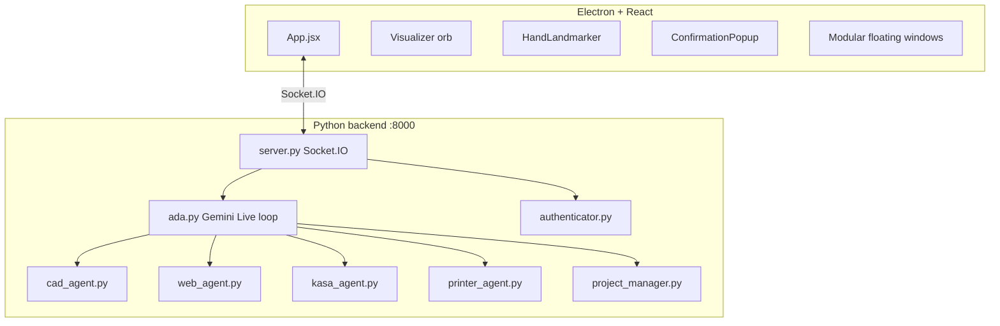

# Revue amont — A.D.A V2 (`vendor/ada_v2-main`)

> **Date :** 2026-08-08  
> **Amont :** [nazirlouis/ada_v2](https://github.com/nazirlouis/ada_v2) — MIT  
> **Emplacement :** `vendor/ada_v2-main/`  
> **Statut JARVIS :** matière à lire / patterns — **pas un runtime**, **pas un import produit**

Document **séparé** de l'audit frontières HUD/Dashboard (`VENDOR_BOUNDARY_AUDIT.md`).

---

## Résumé exécutif

**A.D.A** = *Advanced Design Assistant* — assistant desktop **monolithique** Electron + Python, centré sur **Gemini 2.5 Native Audio** (voix temps réel), avec CAD 3D, impression 3D, domotique Kasa, navigateur Playwright, auth face MediaPipe et UI « Minority Report » (gestes main).

| Verdict | Détail |
|---------|--------|
| **Stack produit ?** | Non — incompatible avec l'architecture JARVIS (Core unique, Policy, Hermes, Ollama/VPS, HUD web passif) |
| **Intérêt vendor ?** | Oui — patterns UX voix, confirmation outils, gestes, visualiseur audio, fenêtres modulaires flottantes |
| **Risque si intégré tel quel** | Double cerveau (Gemini direct vs Core), bypass Policy, dépendance cloud Google, app desktop locale |
| **Action recommandée** | Garder en vendor comme **référence** ; emprunter des **patterns**, pas le runtime |

---

## Stack technique

| Couche | Techno | Fichiers clés |
|--------|--------|---------------|
| Desktop shell | Electron 28 | `electron/main.js` |
| Front | React 18 + Vite + Tailwind + Three.js | `src/App.jsx`, `src/components/*` |
| Transport | Socket.IO (client ↔ server) | port **8000** |
| Backend | Python 3.11 + FastAPI + python-socketio | `backend/server.py` |
| LLM / voix | Google Gemini Live API (`gemini-2.5-flash-native-audio-preview`) | `backend/ada.py` |
| Vision | MediaPipe Face Landmarker + Hand Landmarker | `authenticator.py`, `App.jsx` |
| CAD | build123d → STL | `cad_agent.py` |
| Impression | OrcaSlicer + Moonraker/OctoPrint | `printer_agent.py` |
| Web agent | Playwright Chromium | `web_agent.py` |
| Domotique | python-kasa (TP-Link) | `kasa_agent.py` |
| Mémoire projet | JSON file-based | `project_manager.py` |

**Dépendances notables** (`requirements.txt`) : `google-genai`, `opencv-python`, `pyaudio`, `playwright`, `mediapipe`, `build123d`, `python-kasa`.

**Front** (`package.json`) : `@mediapipe/tasks-vision`, `@react-three/fiber`, `socket.io-client`, `framer-motion`, `three`.

---

## Architecture interne



### Point central : `ada.py` / `AudioLoop`

Tout converge dans une boucle asyncio qui :

1. Ouvre le micro (PyAudio) et stream vers Gemini Live
2. Reçoit audio TTS + transcriptions + tool calls
3. Exécute les tools **dans le même process Python**
4. Émet callbacks vers le front (CAD, browser frame, confirmation, erreurs)

**Différence majeure vs JARVIS :** l'IA **appelle et exécute** les tools localement après confirmation UI — pas de couche Policy Engine intermédiaire, pas de Hermes, pas de séparation satellite/Core.

---

## Capabilities ADA vs JARVIS

| Capability ADA | Implémentation | Équivalent JARVIS | Alignement |
|----------------|----------------|-------------------|------------|
| Voix temps réel | Gemini Native Audio direct | voicebox VPS + Core WS | ❌ Autre stack |
| Face auth | MediaPipe landmarks vs `reference.jpg` | Holomat YuNet/SFace + DB users | ⚠️ Pattern seulement |
| Gestes main | MediaPipe Hand → drag UI | HUD `gestureLive` → Core `gestures.py` | ✅ Pattern proche |
| Domotique | Kasa direct | Home Assistant via Core | ❌ Autre intégration |
| Web agent | Playwright local | Hermes + Agent-Reach | ⚠️ Idée similaire, autre bus |
| CAD / 3D print | build123d + OrcaSlicer | Hors scope JARVIS MVP | — |
| Confirmation outils | `tool_permissions` + popup | Policy + ApprovalCard agentic | ✅ **Pattern précieux** |
| Projets / mémoire | `projects/` JSON local | PostgreSQL + Hermes memory | ❌ |
| Visualiseur orb | Canvas cyan pulse | JarvisOrb / OrbVoyage | ✅ Inspiration visuelle |

---

## Patterns intéressants pour JARVIS

### 1. Confirmation outils (HITL)

**Backend** (`ada.py` L724–766) :

- Chaque tool call vérifie `self.permissions.get(fc.name, True)`
- Si confirmation requise → `Future` + `on_tool_confirmation({ id, tool, args })`
- Le front affiche `ConfirmationPopup` ; l'utilisateur confirme → `resolve_tool_confirmation(id, confirmed)`
- Refus → réponse Gemini « User denied »

**Front** (`ConfirmationPopup.jsx`) : popup plein écran avec nom tool + args JSON — proche de `ApprovalCard` agentic.

**Emprunt JARVIS :** déjà partiellement couvert par `surface.py` / `IntentExecutor` / eve-analyst pattern. ADA montre une **implémentation concrète** avec Future asyncio + Socket.IO event — utile pour `ws_cli` tests ou HUD v2 si le flux confirmation reste synchrone côté session.

### 2. UI modulaire flottante (« Minority Report »)

`App.jsx` : mode `isModularMode` avec positions `{ video, visualizer, chat, cad, browser, kasa, printer, tools }` — fenêtres déplaçables par gestes (pinch / fist / open palm selon README).

**Emprunt JARVIS :** aligné avec la vision HUD Vision Pro **multi-surface passif** — inspiration layout, pas le code Electron.

### 3. Visualiseur audio

`Visualizer.jsx` : canvas 2D, orb cyan pulsé selon `intensity` + état listening/idle (breathing animation).

**Emprunt JARVIS :** complémentaire à `AuthVoiceWave` / `JarvisOrb` — pattern léger sans Three.js lourd.

### 4. Settings outils granulaires

`settings.json` :

```json
{
  "face_auth_enabled": false,
  "tool_permissions": {
    "generate_cad": true,
    "run_web_agent": true,
    "write_file": true
  }
}
```

**Emprunt JARVIS :** modèle simple pour Dashboard admin « matrice permissions par tool » — à exposer depuis Core, pas en JSON local front.

### 5. Transcription temps réel

Callback `on_transcription` → event Socket.IO `transcription` — affichage chat User/ADA.

**Emprunt JARVIS :** pattern pour HUD v2 bandeau sous-titres pendant session voix.

---

## Anti-patterns / incompatibilités JARVIS

| Problème ADA | Pourquoi incompatible |
|--------------|----------------------|
| **Monolithe desktop** | JARVIS = services systemd (core, hud web, hermes, voice) — pas Electron kiosk unique |
| **Gemini direct** | JARVIS = Ollama VPS → OpenRouter → sans LLM ; pas de clé Google obligatoire |
| **Tools exécutés dans ada.py** | JARVIS = IA → Proposition → **Policy** → Autorisation → Exécution |
| **Socket.IO vs WS JARVIS** | Protocole différent ; pas de pont sans réécriture complète |
| **Auth 1 photo locale** | JARVIS = multi-users DB, enroll, rôles ADMIN/USER/CHILD |
| **PyAudio dans backend** | JARVIS = capture micro côté client web / Pi salon ; Core reçoit WAV/utterance |
| **Electron nodeIntegration: true** | Modèle sécu web kiosk JARVIS ≠ app desktop permissive |
| **Kasa direct** | JARVIS domotique = Home Assistant |
| **Pas de offline / JARVIS BASE** | Recovery mode exige Core sans cloud |

---

## Structure fichiers (vue rapide)

```
ada_v2-main/
├── backend/
│   ├── ada.py              # Gemini Live + tool loop (~1300 lignes)
│   ├── server.py           # FastAPI + Socket.IO (~990 lignes)
│   ├── authenticator.py    # Face MediaPipe
│   ├── cad_agent.py        # build123d
│   ├── printer_agent.py    # Moonraker/OctoPrint
│   ├── web_agent.py        # Playwright
│   ├── kasa_agent.py       # TP-Link
│   ├── project_manager.py  # projects/*.jsonl
│   ├── tools.py            # Déclarations tools Gemini
│   └── settings.json
├── src/
│   ├── App.jsx             # ~1700 lignes — cœur UI
│   └── components/         # 11 composants (AuthLock, CadWindow, etc.)
├── electron/main.js        # Lance Vite + spawn python server.py
├── tests/                  # pytest (agents, auth, cad…)
├── requirements.txt
└── package.json
```

**Scripts debug racine** : `check_cuda.py`, `hand_gesture_test.py`, `test_face_rec.py` — dev local, pas produit.

---

## Tests inclus

| Fichier | Couvre |
|---------|--------|
| `tests/test_authenticator.py` | Face auth |
| `tests/test_cad_agent.py` | Génération CAD |
| `tests/test_kasa_agent.py` | Kasa |
| `tests/test_printer_agent.py` | Imprimantes |
| `tests/test_web_agent.py` | Playwright |
| `tests/test_ada_tools.py` | Tools |

Utiles comme **référence de comportement agent**, pas à brancher au CI JARVIS.

---

## Ce qu'il ne faut PAS faire

1. **Importer** ada_v2 comme dépendance ou submodule runtime
2. **Remplacer** `jarvis_core` par `backend/ada.py`
3. **Empiler** Gemini Live en parallèle d'Ollama/Hermes sans arbitrage explicite
4. **Copier** le modèle auth `reference.jpg` single-user
5. **Garder** Electron comme cible HUD — JARVIS = Chromium web + nginx

---

## Ce qu'on peut emprunter (par priorité)

| Priorité | Pattern | Où l'appliquer JARVIS |
|----------|---------|----------------------|
| P1 | Confirmation tool Future + event ID | Core session voix / agentic ApprovalCard |
| P2 | Visualiseur orb canvas léger | HUD v2 bandeau central |
| P3 | UI modulaire positions flottantes | Agentic multi-surface layout |
| P4 | Transcription stream User/Assistant | VoiceBar / sous-titres HUD |
| P5 | Settings `tool_permissions` par nom | Dashboard SystemSettings (via Core API) |
| P6 | Gesture drag windows | HUD gesture mode (déjà amorcé) |

---

## Hygiène vendor

| Action | Raison |
|--------|--------|
| **Garder** le dossier tant que les patterns P1–P3 ne sont pas documentés ailleurs | Référence visuelle + code HITL |
| **Ne pas** committer `.env` / `reference.jpg` | Secrets + biométrie |
| **Ajouter** entrée dans `vendor/README.md` | Registre amont (comme eve-analyst) |
| **Supprimer** quand épuisé | Après extraction patterns → `docs/architecture/` |

---

## Liens internes JARVIS

| Sujet ADA | Doc / code JARVIS |
|-----------|-------------------|
| Confirmation outils | `core/jarvis_core/surface.py`, `docs/architecture/JARVIS-Agentic-UI.md` |
| Gestes | `vendor/hud/.../gestureLive.ts`, `core/jarvis_core/gestures.py` |
| Face auth | `core/jarvis_core/holomat/`, `docs/architecture/FACE_AUTH_CONTRACT.md` |
| Voix | `core/jarvis_core/voice/`, voicebox VPS |
| Policy | `core/jarvis_core/policy.py` |

---

*Revue ADA uniquement. Audit frontières produit : `docs/audit/VENDOR_BOUNDARY_AUDIT.md`.*
