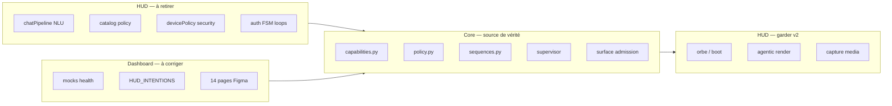

# Audit frontières — post-move vers `vendor/`

> **Date :** 2026-08-08  
> **Contexte :** HUD, Dashboard et Setup déplacés sous `vendor/`. Le produit actif = `core/` + `deploy/` + `docs/`.  
> **Objectif :** identifier ce qui traîne au mauvais endroit (logique métier dans les fronts, mocks, chemins cassés, bruit vendor).

---

## Structure repo actuelle

```
jarvis-os-linux/
├── core/              ← produit (chef d'orchestre)
├── deploy/            ← ops (chemins HUD encore obsolètes)
├── docs/
├── architecture/      ← contrats WS (build.py cassé)
├── assets/            ← coquille vide (README + licences)
└── vendor/
    ├── hud/           ← front HUD (archive / refonte v2)
    ├── dashboard/     ← admin (archive / refonte)
    ├── setup/         ← install MVP
    ├── ada_v2-main/   ← amont tiers (voir audit séparé)
    ├── CopilotKit-main/
    ├── Holomat-main*/
    ├── eve-analyst-main/
    ├── second-brain-research-dashboard-main/
    └── WhatsApp *.jpeg
```

---

## 1. `vendor/hud` — logique qui devrait être dans Core

**Principe :** HUD = shell passif Vision Pro (capture média, rendu, application des `hud_command`). Core = orchestration, policy, auth, intents.

**20 fichiers** portent de la logique métier au lieu du rendu.

### CRITICAL (2)

| Fichier | Problème |
|---------|----------|
| `vendor/hud/src/app/bridge/chatPipeline.ts` | Routeur NLU parallèle au Core : regex intents, ouverture apps, dashboard, locale — le HUD **décide** au lieu d'afficher |
| `vendor/hud/src/app/bridge/devAuthBypass.ts` | `?skipAuth=1` contourne l'auth sans attestation Core |

### HIGH (7)

| Fichier | Problème |
|---------|----------|
| `VoiceChatBridge.tsx` | Double chemin : Core online + fallback local complet offline |
| `openHudApp.ts` | Policy `adminOnly` côté front avant que Core voie l'intent |
| `apps/catalog.ts` | 2e source de vérité (intents, risk, voice, VPS allowlist) |
| `ui/core/devicePolicy.ts` | Règles auth/session/idle lock/gesture — pas de l'UI |
| `SessionLifecycle.tsx` | Timers lock/logout locaux (10–15 min) |
| `faceAuthLive.ts` | Boucle décision auth (stableNeeded, timeout) — pas juste capture caméra |
| `FirstSetupScene.tsx` | Orchestration enroll complète (voix ×3, rôle, séquences) |

### MEDIUM (8)

| Fichier | Problème |
|---------|----------|
| `locale.ts` | Duplique `core/jarvis_core/locale.py` |
| `voiceAuthLive.ts` | Retry policy + challenge text côté front |
| `voiceConfirm.ts` | Moteur dialogue enroll (parseYesNo, askName…) |
| `AuthScene.tsx` | FSM auth/boot + appel `authLogin` après verify local |
| `LockScene.tsx` | Rate limit lockout (`failCount >= 5`) côté front |
| `AdminAuthScene.tsx` | Élévation admin orchestrée localement |
| `AppContext.tsx` | Persistance session / soft-lock household vs remote |
| `faceAuthSimulator.ts` | Auth simulée — hors prod |

### Correctement dans HUD (à garder pour v2)

| Zone | Rôle OK |
|------|---------|
| `src/agentic/` | Rendu surfaces, JSON patch, ApprovalCard display |
| `engine/experienceOrchestrator.ts` | Sync TTS/orb/texte — **présentation**, pas policy |
| `components/orb/`, boot (`OrbVoyage`, `BootScene`) | Visuels cinématiques |
| `bridge/hudCommands.ts` | Applique `hud_command` du Core |
| `bridge/mediaDevices.ts`, `micRecorder.ts`, `stt.ts` | APIs navigateur |
| `AuthVoiceWave`, `FaceCamView`, `HoloFace` | Rendu passif |
| `bridge/peripheralWatch.ts`, `deviceSatellite.ts` | Télémétrie + heartbeat |

### Synthèse HUD

| Sévérité | Count |
|----------|------:|
| CRITICAL | 2 |
| HIGH | 7 |
| MEDIUM | 8 |
| LOW | 3 |

**Ordre migration (quand HUD v2 reprendra) :**

1. Supprimer exécution locale de `interpretCommand` — tout utterance → Core
2. Retirer policy de `catalog.ts` / `openHudApp.ts`
3. Déplacer champs sécurité de `devicePolicy.ts` vers Core
4. Auth face/voix pilotée par `sequences.py` + events Core
5. Locale unique : `core/jarvis_core/locale.py`

---

## 2. `vendor/dashboard` — logique qui devrait être Core API

**Principe :** Dashboard = admin sur FQDN séparé. Core expose capabilities, policy, health, supervisor.

### Pages correctement branchées (modèle à suivre)

| Fichier | WS |
|---------|-----|
| `DashboardOverview.tsx` | `usage` → `usage_result` |
| `AgentReachPage.tsx` | `agent_reach` → `agent_reach_status` |

### CRITICAL — mocks mensongers

| Fichier | Problème |
|---------|----------|
| `RecoveryPage.tsx` | Health checks mock (`hermes: fail`, banner « Checks mock ») |
| `CommandCenter.tsx` | Stats fabriquées (HERMES ONLINE, DOCKER 4↑) |
| `Sidebar.tsx` | Pill « HERMES ONLINE » hardcodée verte |

→ Core expose déjà `supervisor` → `supervisor_status` — **jamais branché**.

### HIGH — catalogues / policy dupliqués

| Fichier | Problème |
|---------|----------|
| `ApplicationsPage.tsx` | `HUD_INTENTIONS` (18 lignes) ≠ `capabilities.py` |
| `SystemSettings.tsx` | Matrice Policy Engine statique |
| `ToolsPage.tsx` | Catalogue outils + ALLOW/CONFIRM inventés |
| `Entities.tsx` | Devices/users fictifs |

### MEDIUM

| Fichier | Problème | Action |
|---------|----------|--------|
| `DeployPage.tsx` | RUNNING/LIVE sans probe | Brancher supervisor |
| `SystemMonitoring.tsx` | Placeholder honnête mais liste statique | Brancher supervisor |
| `HermesCore.tsx` | Skills + health statiques | Brancher hermes.health |
| `AgentsPage.tsx` | Registry agents fictif | Brancher devices API |
| `HolomatPage.tsx` | Pills READY sans query | Brancher supervisor |
| `App.tsx` | `postMessage` HUD (`jarvis:navigate`) | Garder seulement si iframe embed |

### LOW — scaffolds acceptables

`DockerPage.tsx`, `TerminalPage.tsx`, `VoiceManager.tsx`, `AIProviders.tsx`, `types.ts` (HOST hardcodé → env).

### 14 pages Figma mortes — à supprimer

Jamais importées dans `App.tsx` :

```
Fitness.tsx          Tennis.tsx           School.tsx           Money.tsx
Goals.tsx            Planner.tsx          Memory.tsx           Analytics.tsx
AgentHub.tsx         AIAssistant.tsx      ComputerControl.tsx  Coding.tsx
Dashboard.tsx        Settings.tsx
```

+ `imports/pasted_text/jarvis-ai-os.md`  
+ `imports/pasted_text/jarvis-os-architecture.md`

### Synthèse Dashboard

| Sévérité | Count | Dead pages |
|----------|------:|-----------:|
| CRITICAL | 3 | — |
| HIGH | 4 | 14 |
| MEDIUM | 6 | 2 md |

**Ordre remediation :**

1. Supprimer 14 pages + imports paste
2. Brancher Recovery / Sidebar / CommandCenter / SystemMonitoring sur `supervisor_status`
3. Endpoint admin `capabilities` → remplacer `HUD_INTENTIONS`
4. Policy/tools depuis Core, pas matrices statiques
5. Revoir `postMessage` (embed HUD uniquement)

---

## 3. `core/` — ce qui reste vs ce qui est stale

### Reste légitimement dans Core

Auth, policy, voice, holomat CV, `capabilities.py`, `sequences.py`, dialogues YAML, Hermes, surface admission (`surface.py`, `composer.py`, `ui_catalog.json`), DB, smokes.

> `ui_catalog.json` / `composer.py` **semblent** HUD-ish mais sont **Core API** par design (admission avant rendu client).

### Pas de doublon orchestrateurs

| Module | Rôle |
|--------|------|
| `Orchestrator` (`__init__.py`) | WS server + handlers |
| `sequences.py` | Séquences parlées boot/enroll (events Core) |
| `experienceOrchestrator.ts` (HUD) | Présentation TTS/orb — **pas** policy |

### Chemins `hud/` cassés après move

| Fichier | Action |
|---------|--------|
| `architecture/build.py` | `HUD_SRC = hud/src` → `vendor/hud/src` |
| `core/jarvis_core/ui_catalog.json` | `generated_from` → `vendor/hud/...` |
| `capabilities.py`, `holomat/README.md`, `voice/README.md` | Docstrings `hud/src/...` |
| `_smoke_auth_face.py` | Smoke browser → `vendor/hud/scripts/` |
| `deploy/scripts/sync-to-nuc.sh` | Cherche `hud/dist` à la racine |
| `deploy/hermes/SOUL.md`, `skills/hud-apps/SKILL.md` | Références catalog |
| `deploy/nginx/*.conf` | OK runtime `/opt/jarvis/hud/dist` ; build source à corriger |

---

## 4. Racine repo — bruit à nettoyer

| Élément | Verdict |
|---------|---------|
| `tmp_list_users.py`, `tmp-presence-phrase.wav` | Supprimer |
| `assets/orb/` | README + licences seulement → fusionner dans `vendor/hud/public/orb/` |
| `deploy/scripts/_remote-*.sh` | Hotfixes incident — archiver |
| `deploy/manifests/assistant.dev.json` | PySide HUD mort |
| `vendor/README.md` | Obsolète (cite `hud/` à la racine) |
| `vendor/CopilotKit-main/` | Référence — idée migrée agentic maison |
| `vendor/Holomat-main (1)/` | Doublon |
| `vendor/WhatsApp *.jpeg` | Hors repo |
| `vendor/eve-analyst-main`, `second-brain-*` | Matière lue — épuisée selon README |

---

## 5. Vue d'ensemble



| Zone | CRIT | HIGH | MEDIUM | Dead code |
|------|-----:|-----:|-------:|----------:|
| `vendor/hud` | 2 | 7 | 8 | — |
| `vendor/dashboard` | 3 | 4 | 6 | 14 pages |
| `core/` (stale paths) | — | 1 | ~10 refs | 2 tmp root |
| `vendor/` (bruit) | — | — | — | CopilotKit, JPEGs, doublons |

---

## 6. Priorités (Core-first)

1. **Ne pas toucher aux fronts** tant que Core isolé n'est pas stable — tout est dans `vendor/`.
2. **Core** : routage unique (`handle_user_chat`), smokes sans HUD.
3. **Tooling** : fix `architecture/build.py` + `sync-to-nuc.sh` → `vendor/hud/dist`.
4. **Dashboard** (quand repris) : purge pages Figma + brancher `supervisor_status`.
5. **HUD v2** (quand repris) : supprimer `chatPipeline` exécution locale.
6. **Hygiène vendor** : vider CopilotKit, JPEGs, amonts épuisés ; MAJ `vendor/README.md`.

---

*Audit frontières uniquement. Analyse amont ADA : voir `docs/audit/ADA_V2_VENDOR_REVIEW.md`.*
